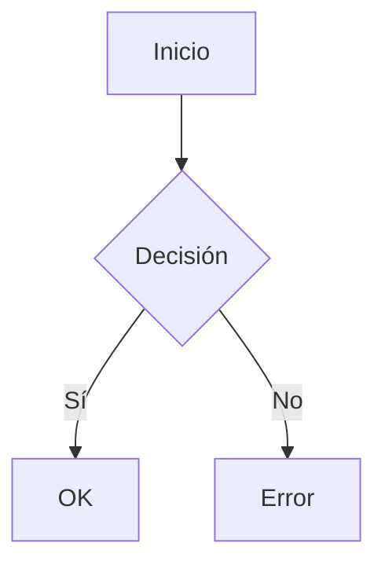

## 0) Integrantes del equipo de estudio y sus responsabilidades en el repositorio 
0. Sebastian Felipe Begazo Puma - SbegazoP@unsa.edu.pe (debido a falta de comunicación decidí hacerlo solo.)
## 1) Conceptos Generales para tener en cuenta
En el contexto del desarrollo web y móvil, es importante distinguir entre tres conceptos fundamentales: librerías, frameworks y patrones de diseño. Comprender estas diferencias permite tomar mejores decisiones técnicas al construir aplicaciones.
 Librerías
Una librería es un conjunto de funciones, clases o herramientas que resuelven tareas específicas. Se utiliza cuando el programador necesita una funcionalidad concreta y quiere evitar escribirla desde cero. La ventaja es que el programador mantiene el control total del flujo del programa.
Por ejemplo, una librería de manipulación de fechas, validación de formularios o animaciones.
Características principales:
•	Proporciona utilidades específicas.
•	El desarrollador decide cuándo y cómo usarla.
•	No impone una estructura de proyecto.
Ejemplos comunes:
•	React (JavaScript): aunque también puede considerarse una librería para construir interfaces.
•	jQuery: para manipulación del DOM.
•	Lodash: funciones de utilidad para trabajar con arrays, objetos y strings.
•	Axios: para hacer peticiones HTTP.
 Frameworks
Un framework es una estructura de trabajo más amplia que proporciona herramientas, reglas y una arquitectura definida para desarrollar una aplicación. A diferencia de una librería, el framework dicta cómo debe organizarse el código y el flujo del programa. Es decir, el programador debe adaptarse al marco del framework.
Esto permite mayor rapidez y consistencia en el desarrollo, especialmente en proyectos grandes o en equipos.
Características principales:
•	Define la arquitectura del proyecto.
•	Controla el flujo de ejecución (inversión de control).
•	Suele integrar múltiples funcionalidades (ruteo, autenticación, base de datos, etc.).
Ejemplos comunes:
•	Frontend: Angular, Vue.js
•	Backend: Django (Python), Laravel (PHP), Express (Node.js)
•	Móvil: Flutter, React Native
 Patrones de Diseño
Los patrones de diseño son soluciones probadas y reutilizables a problemas comunes que surgen al desarrollar software. No son fragmentos de código, sino formas de estructurarlo para que sea más mantenible, escalable y fácil de entender.
Se utilizan en todos los niveles del desarrollo (frontend, backend, móvil) y promueven buenas prácticas en programación orientada a objetos y arquitectura de software.
Características principales:
•	No dependen del lenguaje de programación.
•	Mejoran la organización del código.
•	Fomentan la reutilización y escalabilidad.
Ejemplos comunes:
•	MVC (Modelo-Vista-Controlador): separa la lógica de datos, la lógica de presentación y la lógica de control.
•	Singleton: asegura que una clase tenga solo una instancia.
•	Observer: permite que objetos se suscriban y reciban notificaciones de cambios.
•	Factory: delega la creación de objetos a subclases.
## 2) Conociendo Git
Git es un sistema de control de versiones distribuido. Fue diseñado para ayudar a los desarrolladores a registrar y gestionar los cambios que realizan en su código fuente a lo largo del tiempo, permitiendo así una mejor organización, colaboración y seguridad del desarrollo.
 ¿Qué significa "control de versiones"?
El control de versiones permite a los equipos de desarrollo trabajar de forma más segura y eficiente. Sus principales ventajas incluyen:
•	 Guardar un historial completo de los cambios realizados en los archivos del proyecto.
•	 Revertir a versiones anteriores en caso de errores o problemas.
•	Trabajar en paralelo con otras personas sin sobrescribir los cambios.
•	 Identificar quién hizo qué cambio y cuándo, mejorando la trazabilidad.
 ¿Cómo funciona Git localmente?
Git se instala en la computadora del desarrollador y se utiliza desde la línea de comandos o mediante interfaces gráficas como GitKraken, SourceTree o la extensión de Git en VS Code.
A continuación, se describe un flujo básico de trabajo local:
1. Inicializar un repositorio
Crea un nuevo repositorio en la carpeta actual:
bash
CopiarEditar
git init
Esto crea una carpeta oculta .git donde Git almacenará el historial del proyecto.
2. Agregar archivos al seguimiento de cambios
Agrega un archivo específico al área de preparación (staging):
bash
CopiarEditar
git add archivo.txt
O bien, agrega todos los archivos modificados:
bash
CopiarEditar
git add .
3. Confirmar los cambios (commit)
Guarda los cambios preparados con un mensaje descriptivo:
bash
CopiarEditar
git commit -m "Descripción del cambio realizado"
Este paso crea un punto en el tiempo que registra el estado actual del proyecto.
4. Ver el historial de cambios
Muestra todos los commits realizados en orden cronológico:
bash
CopiarEditar
git log
## 3) Conociendo GitHub
GitHub es una plataforma en línea que permite almacenar repositorios Git de forma remota. Es ampliamente usada en el desarrollo de software colaborativo, ya que facilita compartir proyectos, colaborar en equipo, hacer seguimiento de cambios y controlar versiones desde cualquier lugar.
 ¿Qué es un repositorio remoto?
Un repositorio remoto es una copia del proyecto alojada en la nube, en este caso, en los servidores de GitHub. Sirve como punto central de sincronización para todos los desarrolladores que trabajan en un mismo proyecto.
Git (local) registra los cambios en tu máquina.
 GitHub (remoto) permite compartir esos cambios y colaborar en equipo.
¿Cómo definimos un repositorio?
Un repositorio en GitHub:
•	Contiene el código fuente, documentación y otros archivos del proyecto.
•	Puede ser:
o	Público: cualquiera puede verlo y clonarlo.
o	Privado: solo los miembros autorizados pueden acceder.
•	Se puede vincular con un repositorio local mediante Git.
 Comandos para conectar un repositorio local con GitHub:
bash
CopiarEditar
git remote add origin https://github.com/usuario/proyecto.git
git push -u origin main
🔹 ¿Cómo configurar el repositorio para colaborar en equipo?
1.	Crear el repositorio en GitHub (por el integrante principal).
2.	Ir a:
 Settings > Collaborators
3.	Invitar a los compañeros de equipo usando su nombre de usuario o correo de GitHub.
4.	Cada miembro debe aceptar la invitación en su cuenta o correo.
 Clonar el repositorio remoto:
Cada integrante descarga una copia del repositorio a su máquina local:
bash
CopiarEditar
git clone https://github.com/usuario/proyecto.git
cd proyecto
🔹 ¿Cómo se supervisan y resuelven conflictos?
Cuando varias personas trabajan sobre los mismos archivos, pueden ocurrir conflictos de código al combinar los cambios. Git los detecta automáticamente y requiere intervención manual para resolverlos.
 Buenas prácticas para evitarlos:
•	 Usar ramas: cada desarrollador trabaja en su propia rama.
bash
CopiarEditar
git checkout -b nombre-rama
•	Actualizar con frecuencia el repositorio local para obtener los últimos cambios:
bash
CopiarEditar
git pull origin main
¿Qué pasa si hay un conflicto?
Si al hacer git pull o git merge Git detecta líneas modificadas por más de una persona:
•	Se marcarán los archivos en conflicto.
•	El desarrollador debe editar manualmente los archivos para decidir qué código conservar.
•	Luego de resolver el conflicto:
bash
CopiarEditar
git add archivo-conflicto
git commit -m "Conflicto resuelto"
## 4) Desarrollador Frontend
El Desarrollador Frontend es el responsable de construir la parte visual e interactiva de una aplicación web o móvil. Se enfoca en todo lo que el usuario puede ver y con lo que puede interactuar directamente, como menús, botones, formularios, animaciones, etc.
 Descripción del rol
Un desarrollador frontend transforma los diseños de UI/UX en código funcional utilizando tecnologías web. Se encarga de la experiencia del usuario (UX) y de la interfaz de usuario (UI), garantizando que la aplicación sea intuitiva, accesible, rápida y visualmente atractiva.
También colabora con backend para integrar la lógica de negocio y los datos en la interfaz.
Habilidades requeridas
Técnicas:
•	HTML5, CSS3 y JavaScript
•	Consumo de APIs (REST o GraphQL)
•	Manejo del DOM y eventos
•	Responsive Design (diseño adaptable)
•	Control de versiones con Git
•	Testing básico (unitario y visual)
•	Accesibilidad web (a11y)
•	Buenas prácticas de SEO (básico)
Blandas:
•	Comunicación con equipos de diseño y backend
•	Atención al detalle
•	Creatividad
•	Capacidad de adaptación a cambios de diseño o requerimientos

Relación con otros roles
•	Backend: El frontend se comunica constantemente con el backend para recibir datos (por ejemplo, productos, usuarios, mensajes, etc.) a través de APIs.
•	QA: Trabaja con QA para validar que la interfaz cumple con las funcionalidades esperadas y sea libre de errores.
•	Desarrollador Android: Comparte ideas y estilo visual para mantener coherencia si hay versión web y móvil nativas.
•	Diseñador UX/UI: Recibe diseños y especificaciones para implementarlos en código.
 Stack tecnológico típico
Lenguajes:
•	HTML
•	CSS / Sass
•	JavaScript (y en algunos casos, TypeScript)
Frameworks y librerías:
•	React o Vue.js
•	Tailwind CSS o Bootstrap
Herramientas adicionales:
•	Figma (para revisar diseños)
•	Git + GitHub
•	Visual Studio Code (editor)
•	Chrome DevTools
•	Vite o Webpack (según configuración del proyecto)
## 5) Links recomendados para capacitación Rol Frontend

A continuación se presentan recursos recomendados para aprender desarrollo frontend, organizados por tipo:
Sin certificaciones(tutoriales gratuitos y accesibles sin cuenta)
- [freeCodeCamp - Responsive Web Design](https://www.freecodecamp.org/learn/responsive-web-design/)
- [MDN Web Docs - HTML, CSS, JS](https://developer.mozilla.org/es/)
- [W3Schools - Frontend Basics](https://www.w3schools.com/)
- [CSS-Tricks](https://css-tricks.com/)
- [JavaScript.info](https://javascript.info/)
Con certificación(requiere cuenta gratuita o de pago)
- [freeCodeCamp - Certificaciones Frontend](https://www.freecodecamp.org/)
- [Google - Fundamentos del Desarrollo Web (Coursera)](https://www.coursera.org/learn/web-development)
- [Frontend Developer Career Path - Codecademy](https://www.codecademy.com/learn/paths/front-end-engineer-career-path)
- [Desarrollo Web Completo - Udemy](https://www.udemy.com/course/desarrollo-web-completo-con-html5-css3-js-php-y-mysql/)
Proyectos completos de ejemplo(para practicar y mejorar portafolio)
- [Frontend Mentor - Desafíos de diseño reales](https://www.frontendmentor.io/)
- [JavaScript 30 - 30 proyectos sin frameworks](https://javascript30.com/)
- [GitHub - Awesome Frontend Projects](https://github.com/sadanandpai/frontend-mini-challenges)
Recomendadas por líderes (Microsoft, AWS, Google)
- [Google Developers - Web Fundamentals](https://developers.google.com/web/fundamentals)
- [Microsoft Learn - Web Development](https://learn.microsoft.com/en-us/training/paths/web-development-101/)
- [AWS - Frontend Web & Mobile Guides](https://aws.amazon.com/frontend-web-mobile/)
- [Web.dev (de Google)](https://web.dev/)
## 6) Desarrollador Backend
El Desarrollador Backend es responsable de la lógica de negocio, la gestión de bases de datos, la seguridad y todas las operaciones que ocurren en el "lado del servidor". Aunque el usuario final no lo ve, su trabajo es esencial para que la aplicación funcione correctamente.
 Descripción del rol
El backend procesa solicitudes del frontend, ejecuta la lógica del sistema, accede a la base de datos y devuelve respuestas. Además, maneja funcionalidades como autenticación, autorización, cifrado, gestión de usuarios, pagos, y procesamiento de archivos.
 Habilidades requeridas
Técnicas:
•	Programación orientada a objetos y/o funcional
•	Bases de datos relacionales y no relacionales
•	Desarrollo y consumo de APIs (REST o GraphQL)
•	Seguridad: autenticación, cifrado básico, autorización
•	Pruebas unitarias e integración
•	Control de versiones con Git
•	Conceptos básicos de servidores y despliegue
Blandas:
•	Pensamiento lógico y resolución de problemas
•	Comunicación clara con frontend y QA
•	Documentación efectiva de APIs
•	Colaboración y trabajo en equipo
 Relación con otros roles
•	Frontend: Suministra los datos y lógica mediante APIs que son consumidas en la interfaz.
•	QA: Trabajan conjuntamente para verificar la lógica del sistema y detectar errores.
•	Android/iOS: Proveen los mismos servicios a apps móviles a través de interfaces REST o similares.
Stack tecnológico típico
Lenguajes:
•	JavaScript (Node.js)
•	Python (Django o Flask)
•	PHP (Laravel)
Frameworks y herramientas:
•	Express (Node.js)
•	Django (Python)
•	Laravel (PHP)
Otros:
•	PostgreSQL o MongoDB
•	Docker (contenedores básicos)
•	Postman (para pruebas de APIs)
•	GitHub Actions (CI/CD básico)
## 7) Links recomendados para capacitación Rol Backend
A continuación, se presentan recursos útiles para aprender desarrollo backend, desde lo básico hasta nivel intermedio/avanzado.
Sin certificación(gratuitos y accesibles sin registro)
- [The Odin Project - Backend Path](https://www.theodinproject.com/paths/full-stack-javascript)
- [MDN Web Docs - APIs y servidores](https://developer.mozilla.org/en-US/docs/Learn/Server-side)
- [w3schools - Backend Technologies](https://www.w3schools.com/backend/default.asp)
- [Node.js documentación oficial](https://nodejs.org/es/docs/)
- [Full Stack Open (sección backend)](https://fullstackopen.com/en/)
Con certificación(requiere cuenta o pago)
- [freeCodeCamp - APIs y Microservicios (certificado)](https://www.freecodecamp.org/learn/back-end-development-and-apis/)
- [Coursera - Backend con Node.js y Express (IBM)](https://www.coursera.org/learn/server-side-nodejs)
- [Udemy - Node.js, MongoDB y Express desde cero](https://www.udemy.com/course/node-de-cero-a-experto/)
- [Codecademy - Backend Engineer Path](https://www.codecademy.com/learn/paths/back-end-engineer-career-path)
Proyectos completos de ejemplo** *(repositorios y retos prácticos)
- [GitHub - Backend Practice Projects](https://github.com/donnemartin/system-design-primer)
- [Node.js Project Examples](https://github.com/topics/nodejs-project)
- [REST API con Flask (proyecto básico)](https://github.com/san089/Udemy-django-rest)
- [Build a RESTful API with Django](https://realpython.com/django-rest-framework-quick-start/)
Recomendadas por líderes (Microsoft, AWS, Google)
- [Google Cloud - Backend Dev Guides](https://cloud.google.com/learn/backend)
- [Microsoft Learn - Crea APIs con .NET y Node](https://learn.microsoft.com/en-us/training/paths/build-web-api-aspnet-core/)
- [AWS - Backend Architecture & Microservices](https://aws.amazon.com/microservices/)
- [Google - Backend Foundations (Coursera)](https://www.coursera.org/learn/backend-development)
## 8) Rol QA (Quality Assurance)
El rol de QA (Quality Assurance) se enfoca en asegurar que el software funcione correctamente, cumpla con los requisitos definidos y esté libre de errores críticos antes de su entrega al usuario final. Es clave para mantener la calidad y estabilidad del producto.
 Descripción del rol
El QA planifica, ejecuta y automatiza pruebas para validar funcionalidades, rendimiento y estabilidad del sistema. Puede trabajar con pruebas manuales y/o automatizadas, y colabora con los equipos de desarrollo y diseño desde etapas tempranas del proyecto.
 Habilidades requeridas
Técnicas:
•	Conocimiento de tipos de prueba: funcionales, de regresión, integración, carga
•	Herramientas de testing manual: Jira, TestLink
•	Automatización con herramientas como Selenium o Cypress
•	Creación de casos de prueba y reporte de bugs
•	Comprensión básica de desarrollo web (HTML, JavaScript)
Blandas:
•	Pensamiento crítico y atención al detalle
•	Comunicación efectiva con desarrolladores y líderes
•	Organización y buena documentación
•	Capacidad para adaptarse a cambios y trabajar con deadlines
Relación con otros roles
•	Frontend y Backend: Verifica nuevas funcionalidades e integraciones.
•	Product Owner: Informa sobre el estado general de calidad del producto.
•	DevOps / Líder técnico: Participa en pruebas automatizadas dentro del flujo de CI/CD.

Tipos comunes de pruebas realizadas por QA
•	Pruebas funcionales: Validan que las funcionalidades cumplan su propósito.
•	Pruebas de regresión: Detectan si algo dejó de funcionar tras nuevos cambios.
•	Pruebas de integración: Aseguran que los módulos trabajen correctamente entre sí.
•	Pruebas de rendimiento: Evalúan tiempos de respuesta y estabilidad bajo carga.
•	Pruebas de usabilidad y accesibilidad: Mejoran la experiencia del usuario final.
## 9) Links recomendados para capacitación Rol QA

Estos recursos están organizados para cubrir tanto pruebas manuales como automatizadas, y ofrecen diferentes niveles de profundidad para quienes se inician o desean especializarse en QA.
Sin certificación(gratuitos y accesibles sin registro)

- [Software Testing Help - Tutoriales QA](https://www.softwaretestinghelp.com/)
- [Guru99 - Testing Manual y Automatizado](https://www.guru99.com/software-testing.html)
- [Testing Automation University](https://testautomationu.applitools.com/)

 Con certificación(requiere cuenta o pago)
- [Coursera - Software Testing and Automation](https://www.coursera.org/specializations/software-testing-automation)
---
## 10) Desarrollador Android
El Desarrollador Android crea aplicaciones móviles que funcionan en dispositivos con el sistema operativo Android. Se enfoca en interfaces móviles, conectividad, rendimiento y experiencia de usuario optimizada para móviles.
Descripción del rol
Diseña, desarrolla y mantiene apps nativas usando herramientas del ecosistema Android. Estas apps se integran con servicios backend, APIs, almacenamiento local y deben adaptarse a distintos dispositivos y versiones del sistema operativo.
También es responsable de cumplir con las políticas de publicación en Google Play.
Habilidades requeridas
Técnicas:
•	Kotlin y/o Java (lenguajes oficiales)
•	Uso de Android Studio
•	Manejo del ciclo de vida de actividades y fragmentos
•	Interfaces con XML o Jetpack Compose
•	Consumo de APIs REST
•	Almacenamiento local (Room o SQLite)
•	Pruebas con JUnit y Espresso
•	Git para control de versiones
Blandas:
•	Resolución de errores en entornos móviles
•	Comunicación con backend y diseño
•	Atención al detalle en usabilidad
•	Capacidad de documentación clara
 Relación con otros roles
•	Frontend: Comparte lógica o diseño si existe versión web.
•	Backend: Consume servicios y datos mediante APIs.
•	QA: Colabora en pruebas en distintos dispositivos físicos o emuladores.

🔹 Stack tecnológico típico
Lenguajes:
•	Kotlin (preferido)
•	Java (proyectos heredados)
Herramientas:
•	Android Studio
•	Android SDK
•	Firebase (para autenticación, base de datos, notificaciones)
•	Git + GitHub
Librerías comunes:
•	Jetpack Compose (interfaces modernas)
•	Retrofit (APIs)
•	Room (almacenamiento local)
## 11) Links recomendados para capacitación Rol Android

Estos recursos están orientados a aprender desarrollo de aplicaciones móviles en Android, desde conceptos básicos hasta buenas prácticas modernas usando Kotlin y Jetpack.

---

🔹 **Sin certificación** *(gratuitos y accesibles sin registro)*

- [developer.android.com - Documentación oficial de Android](https://developer.android.com/)
- [Jetpack Compose Pathway (Google)](https://developer.android.com/jetpack/compose/tutorial)
- [freeCodeCamp - Curso completo de Android con Java (YouTube)](https://www.youtube.com/watch?v=fis26HvvDII)

---

🔹 **Con certificación** *(requiere cuenta o pago)*
- [Coursera - Android App Development (Meta)](https://www.coursera.org/specializations/meta-android-developer)
---

 **Proyectos completos de ejemplo**

- [GitHub - Android Samples by Google](https://github.com/android/sunflower)
- [Android Example Projects (en Kotlin y Java)](https://github.com/topics/android)
- [Real World Android App (Clean Architecture)](https://github.com/android/nowinandroid)

---

 Recomendadas por (Google, AWS)

- [Google Android Developer Training](https://developer.android.com/courses)
- [AWS Amplify - Backend para apps móviles](https://docs.amplify.aws/start/getting-started/setup/q/integration/android/)
## 12) Pasos a Desarrollar

Este apartado detalla cómo iniciar el proyecto colaborativo en GitHub, desde la creación del repositorio hasta su configuración para trabajo en equipo.

---

 1. Crear el repositorio remoto

El **Integrante 0 (José Jiménez)** debe:

1. Iniciar sesión en [GitHub](https://github.com/)
2. Crear un nuevo repositorio llamado:  
3. Opcional: Añadir un archivo `README.md` y una `.gitignore` (tipo: Node, Python, etc.)

---

 2. Compartir el repositorio con el equipo

Desde el repositorio creado:

1. Ir a **Settings** (Configuración) > **Collaborators**
2. En la sección **Manage Access**, invitar al resto del equipo ingresando sus usuarios de GitHub o correos electrónicos

Los compañeros recibirán una invitación por correo o notificación en GitHub.
3. Clonar el repositorio (todos los integrantes)
Una vez aceptada la invitación:
```bash
# Entrar a una carpeta de trabajo local
cd practica
# Clonar el repositorio (cambiar URL si es diferente)
git clone https://github.com/josej/EstudioRolesBasicos.git
# Ingresar al repositorio
cd EstudioRolesBasicos
# Verificar archivos
ls       # En Linux/Mac
dir      # En Windows
 4. Colaboración en equipo
Cada integrante puede:
•	Crear su rama (git checkout -b nombre-rama)
•	Subir sus cambios (git push origin nombre-rama)
•	Crear Pull Requests para revisión
•	Revisar conflictos antes de fusionar (merge) en main
 Ejemplo de enlace de configuración
text
CopiarEditar
https://github.com/josej/EstudioRolesBasicos/settings/access
Conociendo algo de mermaid y markdown
Mermaid y Markdown son herramientas complementarias pero con propósitos diferentes. Aquí te explico sus diferencias y similitudes:
1 Markdown (.md)
Es un lenguaje de marcado ligero para formatear texto plano de manera sencilla, que se convierte en HTML.
1 Sintaxis simple: Usa símbolos como #, *, > para títulos, listas, citas, etc.
markdown
CopiarEditar
# Título  
- Lista  
**negrita**
2 Propósito principal: Documentación legible en repositorios (como README.md)
3 Soporte nativo en GitHub/GitLab: Se renderiza automáticamente
4 No es programable: Solo estructura texto e imágenes
2 Mermaid
Es una librería de diagramación que permite crear gráficos mediante código dentro de documentos Markdown.
1 Sintaxis específica: Usa bloques de código con la etiqueta mermaid
markdown
CopiarEditar

2 Propósito principal: Generar diagramas (flujos, UML, Gantt, etc.) sin herramientas externas
3 Requiere soporte: Funciona en GitHub/GitLab con renderizadores compatibles (no en todos lados)
4 Es programable: Permite lógica para estructurar gráficos
3 Similitudes
1 Ambos usan texto plano: Son legibles sin renderizar
2 Se integran en .md: Mermaid vive dentro de bloques de código en Markdown
3 Uso en documentación: Ideales para repositorios y wikis
4 Diferencias clave
1 Markdown sirve para formatear texto
2 Mermaid sirve para crear diagramas visuales
3 Markdown se renderiza en casi todas las plataformas
4 Mermaid solo se renderiza donde hay soporte (como GitHub o algunas extensiones de VS Code)
5 Markdown se enfoca en contenido escrito, Mermaid en diagramas
5 Ejemplo combinado (Markdown + Mermaid)
markdown
CopiarEditar
# Documentación del Proyecto
 Diagrama de flujo
```mermaid
flowchart LR
    A[Cliente] --> B[API]
    B--> C[Base de datos]
 Pasos
1. Ejecutar `npm install`
2. Abrir `index.html`
6 ¿Cuándo usar cada uno?
1 Usa Markdown para READMEs, documentación, wikis, notas simples
2 Usa Mermaid para diagramas técnicos, arquitectura, flujos de trabajo
Nota: GitHub soporta ambos, pero verifica si tu plataforma (como Slack o GitLab) también renderiza Mermaid.
